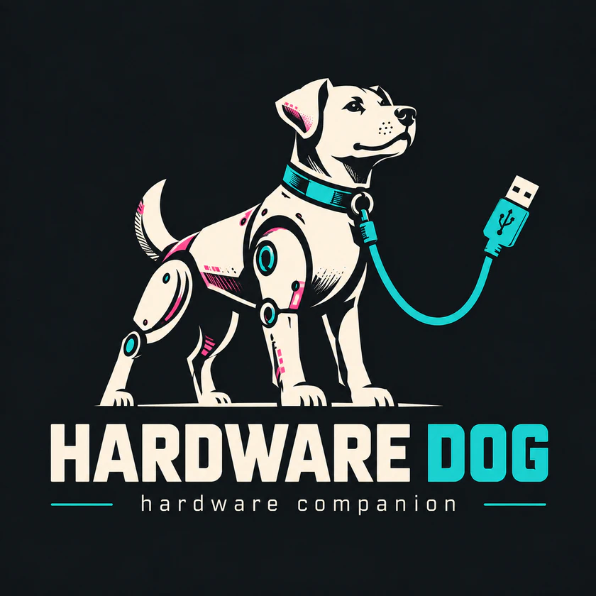

<p align="center">
  
</p>

```text
██╗  ██╗██╗    ██╗    ██████╗  ██████╗  ██████╗
██║  ██║██║    ██║    ██╔══██╗██╔═══██╗██╔════╝
███████║██║ █╗ ██║    ██║  ██║██║   ██║██║  ███╗
██╔══██║██║███╗██║    ██║  ██║██║   ██║██║   ██║
██║  ██║╚███╔███╔╝    ██████╔╝╚██████╔╝╚██████╔╝
╚═╝  ╚═╝ ╚══╝╚══╝     ╚═════╝  ╚═════╝  ╚═════╝

           / \__
          (    @\___
          /         O================[ USB ]
         /   (_____/
        /_____/   \

hardware companion // SNIFF THE PROBLEM.
```

Hardware Dog is my open-source hardware diagnostic companion.

I am building it to observe power, USB, serial, embedded buses and network
behavior on one synchronized timeline.

I want one instrument that can help answer a very simple question:

> **What actually happened?**

```text
┌──────────────────────────────────────────────────────┐
│               H A R D W A R E   D O G                │
│                  hardware companion                  │
├──────────────────────────────────────────────────────┤
│ Booting core systems...                              │
│ [ OK ] power monitor                                 │
│ [ OK ] usb interface                                 │
│ [ OK ] serial interface                              │
│ [ OK ] network probe                                 │
│ [ OK ] event pipeline                                │
│ [ OK ] trace engine                                  │
│ [ OK ] diagnostics rules                             │
│                                                      │
│ Device ID      : HD-001                              │
│ Firmware       : 0.1.0                               │
│ Mode           : LOCAL                               │
│ Session        : READY                               │
│                                                      │
│ Type HELP for commands                               │
└──────────────────────────────────────────────────────┘
```

---

## STATUS

```text
[ OK ] DESIGN SPEC       docs/DESIGN_SPEC.md
[ OK ] WEB INTERFACE     0.1.0, runs against the built-in simulator
[ OK ] WIRE PROTOCOL     v1, docs/PROTOCOL.md
[ -- ] FIRMWARE          NOT STARTED
[ -- ] HARDWARE          NOT STARTED
```

---

## RUN THE INTERFACE

```text
REQUIRES    Node.js 20+
```

```sh
cd web
npm ci
npm run dev        # http://localhost:5173
npm run check      # typecheck + tests + production build
npm run demo       # open the interface against the simulator
```

The simulator runs 11 physical **fault scenarios** (undervoltage, DHCP,
DNS, serial framing, intermittent USB, reset loop, unstable network,
upstream outage, overcurrent, USB not enumerated, healthy baseline). A
deterministic diagnostic engine must name each one exactly, with no false
positive on the healthy baseline: see [`docs/DIAGNOSTICS.md`](docs/DIAGNOSTICS.md).

With no hardware attached, Hardware Dog boots against a **simulated device**
with a marginal power supply, so every screen has something real to show.
The simulator is labeled as such everywhere, including exported reports.
With firmware available, **SETUP → CONNECT WEB SERIAL** talks to the real
device (Chromium-based browsers).

```text
F1 HELP   F2 TRACE   F3 PROBE   F4 REPORT   1-7 SCREENS   CTRL+K COMMAND
```

Architecture: [`docs/ARCHITECTURE.md`](docs/ARCHITECTURE.md)

---

## WHAT IT IS

A small field diagnostic box you can actually keep in your bag.
Plug it in, and it tells you what is really going on:

```text
POWER     voltage, current, peaks, drops, USB power negotiation
USB       enumeration, descriptors, VID/PID, speed, connect/disconnect
SERIAL    UART monitor, baud detection, RX/TX counters
BUS       I2C scan (SPI / CAN later)
NET       link, DHCP, gateway, DNS, internet, latency, packet loss
TRACE     every event from every source on one clock
REPORT    exportable diagnostic report, engineering-doc style
```

Hardware Dog **sniffs** (passive), **probes** (active), **watches**,
**traces** and **reports**.

---

## PRINCIPLES

```text
LOCAL FIRST       no account, no cloud required, your data stays yours
NO FAKE CERTAINTY observation / correlation / hypothesis are kept apart
TOOL FIRST        looks like an instrument before it looks like software
DENSE, NOT NOISY  maximum relevant information, minimum confusion
```

Example of what a report says — and what it refuses to say:

```text
OBSERVED        USB disconnected at 12:42:02.088
OBSERVED        Voltage dropped to 4.61 V at 12:42:02.011
CORRELATION     4 of 5 USB disconnects followed voltage drops.
POSSIBLE CAUSE  Power instability.
```

---

## STACK

```text
HARDWARE   ESP32-S3 or RP2040, small display, USB-C, optional Ethernet,
           protected UART / I2C inputs, INA226 power sense
FIRMWARE   C/C++ or Rust, real-time acquisition, local diagnostic storage
WEB        local dashboard served by the device, WebUSB / WebSerial
ENCLOSURE  3D-printable, ~120 x 75 x 25 mm, matte dark with pink accents
```

Everything is public: PCB, firmware, enclosure, frontend and documentation.

---

## LICENSE

Hardware Dog is **source-available under a dual-license model**.

```text
PERSONAL / HOBBY / GARAGE HACKERS      FREE
  Clone it, build it, flash it, print the enclosure,
  repair your own equipment.
  -> PolyForm Noncommercial License 1.0.0 (see LICENSE)

COMPANIES / RESELLERS / SERVICES       COMMERCIAL LICENSE
  Manufacturing, selling, distributing, or integrating
  Hardware Dog into a product or service requires a
  commercial license from the author.
  -> see COMMERCIAL.md
```

Copyright (c) 2026 Sebastien Germain (Seub G.). All rights not expressly
granted by the license are reserved.

---

<p align="center"><sub>HARDWARE DOG // hardware companion // SNIFF THE PROBLEM.</sub></p>

```text
   ____  ___           _       ___
  / / / / __| ___ _  _| |__   / __|
 / / /  \__ \/ -_) || | '_ \ | (_ |_
/_/_/   |___/\___|\_,_|_.__/  \___(_)
```
